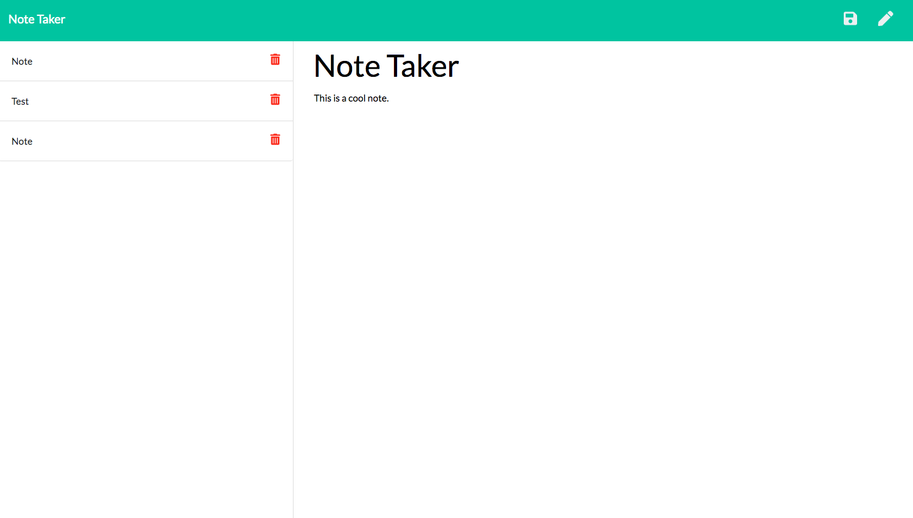

 # Note Taker App
  

 ## Description
 Our project consisted of creating an express JS server which  ran a website and stored client information locally and to heroku. The user could first write down which will route  client   information on the index.html page and then the client can save and store their information by routeing to the  notes.html page"
 
 ## Librarties and Frameworks
 
  - Html
 - CSS
 - Javascript
 - Node JS
 - Express JS
 
 ## Test

 ```
 No testing was used in this project
 ```
 
 ```
## install
 I used node module  dependencie express which helped route the files onto the local and heroku server 
 ```

## Github
https://github.com/BrianLevin/

## email
bml201095@gmail.com

## Usage
```
The purpose of this repo is to take and save notes.
```

## Contributing

The user can feel free to take as many notes as they like!

## Deployed Application

https://serene-crag-34434.herokuapp.com/


 
 
