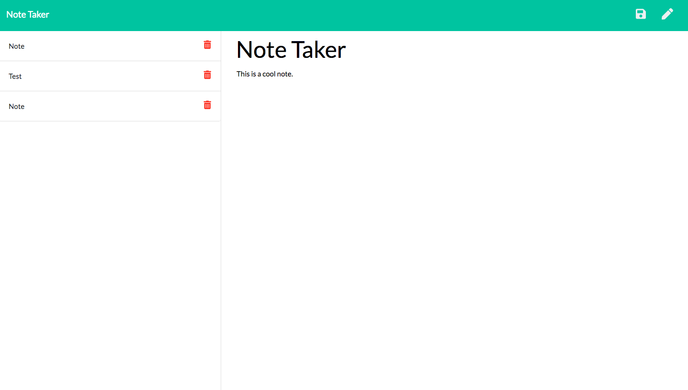

 # Note Taker App
  

 ## Description
 Our project consisted of creating an express JS server which  ran a website and stored client information. The user could first write down client information on the index.html page and then the client can save and store their information on the notes.html page"
 
 ## Librarties and Frameworks
 
  - Html
 - CSS
 - Javascript
 - Node JS
 - Express JS
 
 ## Test

 ```
 No testing was used in this project
 ```
 
 ```
## install
 I used node module  dependencie express and copy and pasted it into a package.json file. I then down loaded an npm install to run the node modules. 
 ```

## github
https://github.com/BrianLevin/

## email
bml201095@gmail.com

## usage
```
The purpose of this repo is to take and save notes.
```

## contributing

The user can feel free to take as many notes as they like!


 
 
