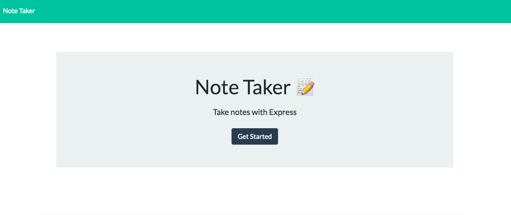
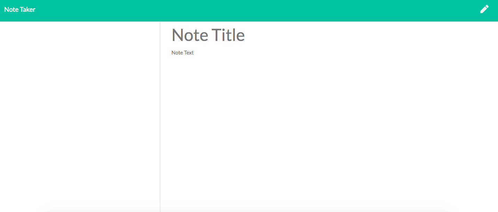
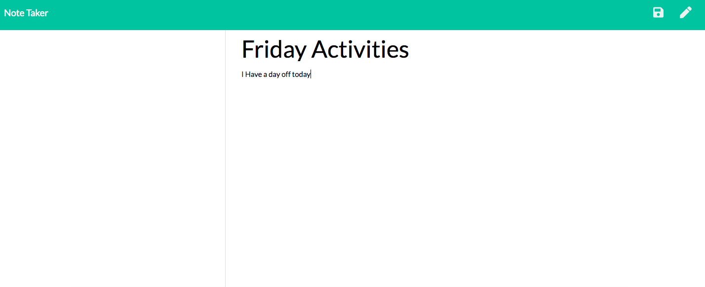
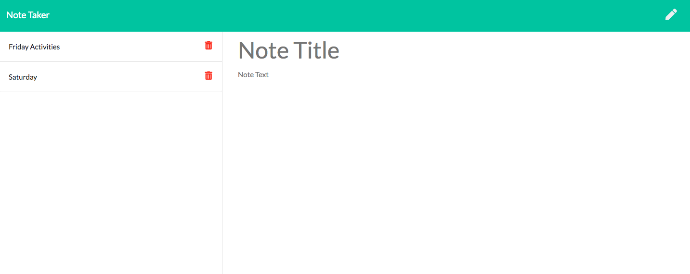
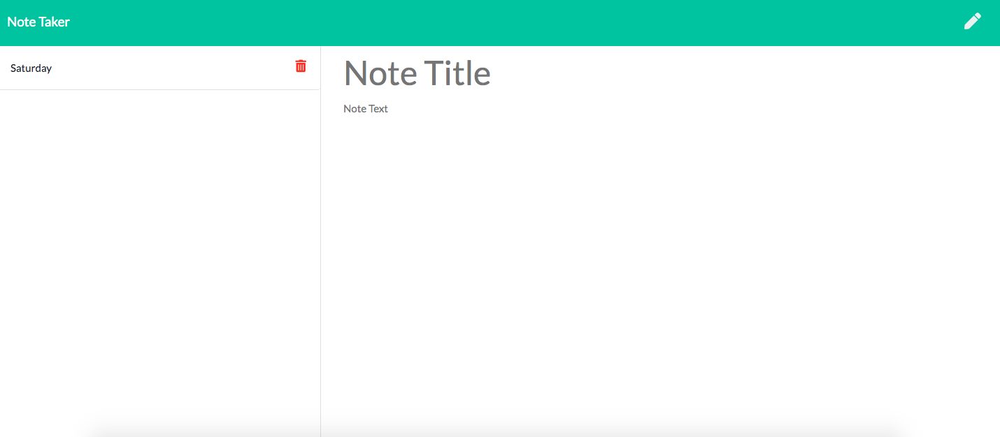

 # Note Taker App
 

 ## Description
 This Note taking application allows users to write down, save and delete notes. This application  uses an express backend and save and retrieve note data from a JSON file. 
 
  ## Click [here](https://serene-crag-34434.herokuapp.com/) for the live app.
  
   This is the home screen:
 
   
 
 This is the default page:
 
  
  
  The user can write down the title and description of the note and then save it by clicking the top right of the age:
  
    
   
   The saved notes can then be deleted by clicking on the delete icon:
     
       
     
 ## Librarties and Frameworks
 
  - Html
 - CSS
 - Javascript
 - Node JS
 - Express JS
 

## email
bml201095@gmail.com

 
 
